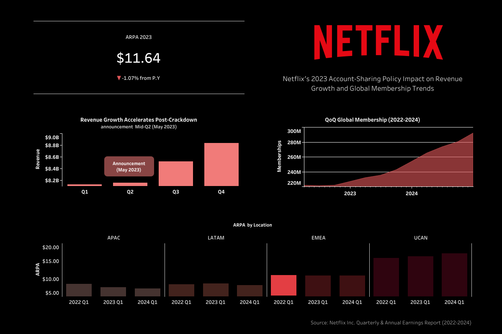

# Netflix Account-Sharing Crackdown: Business Impact Analysis (2022–2024)

## Dashboard Preview

**Live Dashboard:** [https://public.tableau.com/views/NetflixAccountSharing-CrackdownRevenueARPUandMembershipImpact/Dashboard1?:language=en-US&:sid=&:redirect=auth&:display_count=n&:origin=viz_share_link]

---

## Overview

This project analyzes Netflix’s 2023 account-sharing policy and its impact on revenue growth, global memberships, and ARPA (Average Revenue Per Account) trends between 2022 and 2024.

The goal was to evaluate whether the crackdown had changed growth dynamics using Netflix's quarterly earning reports. As of 2025, Netflix has discontinued reporting membership data, eliminating ARPA calculations in recent quarters.
---

## Data Source

Data was extracted from the [“Regional Information” worksheet](https://s22.q4cdn.com/959853165/files/doc_financials/2024/q4/Q4-24-Website-Financials.xlsx) in Netflix’s Q4 2024 earnings report.

---

## Approach

- Restructured quarterly earnings report for querying purposes
- Used SQL to calculate:
  - Global & regional ARPA  
  - Quarterly revenue trends  
  - Membership growth trends  
- Built a dashboard to visualize trends and contextualize timing  

---

## Key Findings

- Revenue growth accelerated following the Q2 2023 policy rollout.
- Global memberships increased into 2024.
- ARPA slightly declined in 2023 despite revenue growth.

---

## Tools Used

- SQL  
- Tableau  
- Excel / CSV preprocessing  

---

## Key Takeaway

- Netflix’s 2023 account-sharing crackdown coincided with revenue growth following the mid-Q2 announcement, while ARPA remained relatively the same. This suggests that this post-policy growth was driven primarily by new paying accounts rather than hikes in subscription costs.